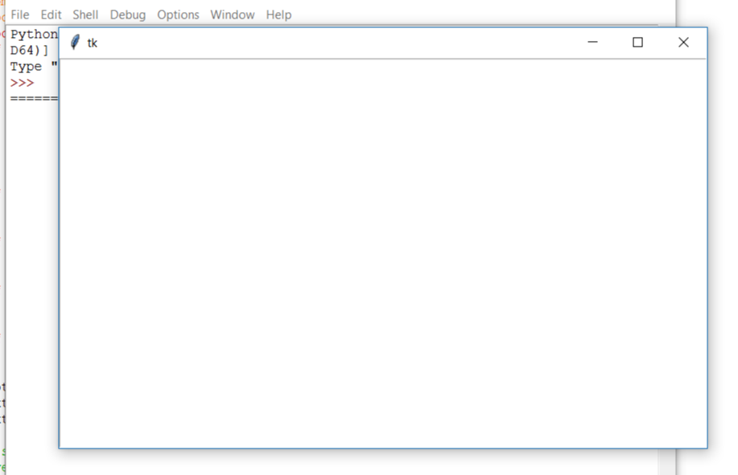
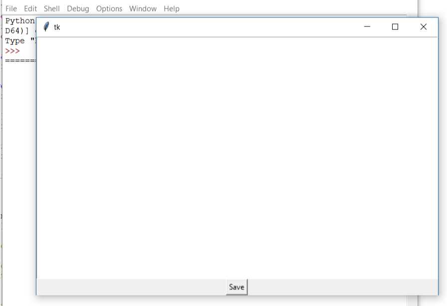
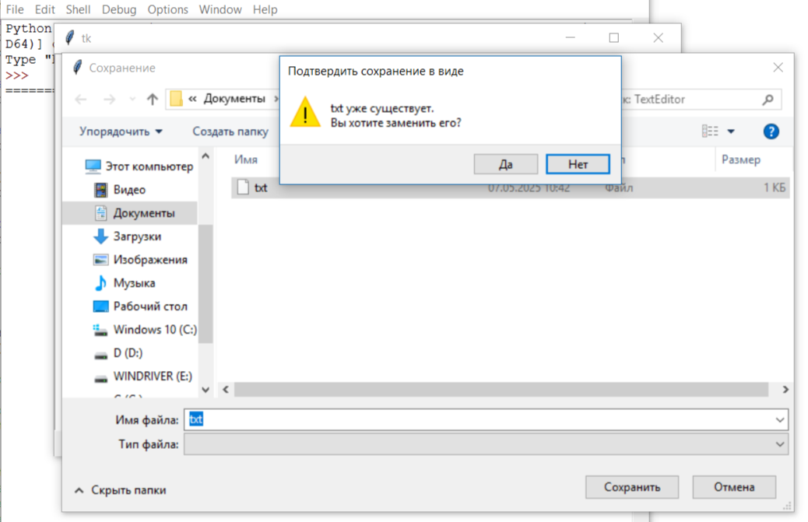
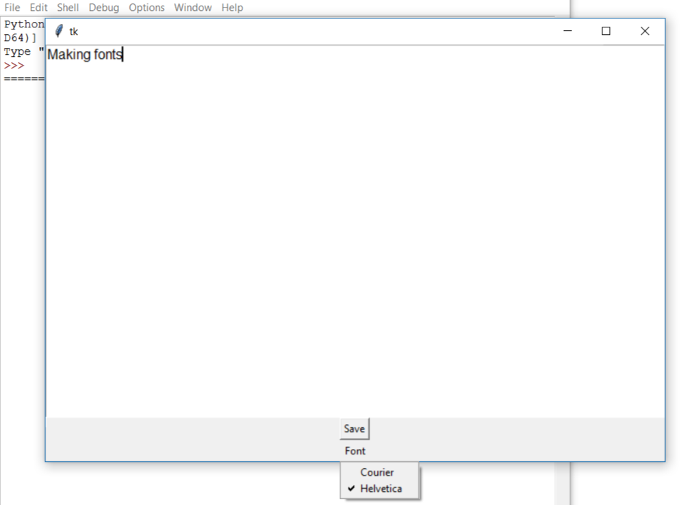

#Туториал по созданию текстового редактора.   
Данное руководство предусматривает реализацию простейшего текстового редактора на Python, поэтому перед началом работы стоит ознакомиться с базовыми методами работы в Python:   
•	Операции сравнения и присваивания.    
•	Ветвление: оператор if.  
•	Описание функции: def.  
•	Импорт библиотек и работа с ними.   
А также рекомендуется ознакомиться с библиотекой tkinter, а особенно с tkinter.filedialog и методом .grid(), т.к. они будут использованы в коде.    
Итак, начнём написание кода. Сперва экспортируем библиотеки:   
'''python
from tkinter import *
import tkinter.filedialog'''   
Теперь создадим окно, в котором мы будем работать с текстом:   
'''python
root=Tk("Text Editor")
text=Text(root)
text.grid()'''   
В конце программы окно надо будет закрыть. Весь остальной код будет располагаться в программе ДО строчки с закрытием окна, но напишем её сейчас, чтобы промежуточных запусках (пока редактор написан не полностью) программа корректно работала:   
'root.mainloop()'   
Если вы сейчас запустите код, то увидите примерно следующее:    
   
Итак, окно редактора у нас есть, но нам нужно будет куда-то сохранять прогресс. Для этого пропишем функцию 'saveas()' после импорта библиотек. Её также можно прописать внутри вызова окна или в конце кода, но для лучшей читаемости кода напишем её после импорта:    
'''python
def saveas():
    global text  
    t = text.get("1.0", "end-1c")
    savelocation=tkinter.filedialog.asksaveasfilename()
    if (savelocation != ''):#Модификация проекта - обработка ошибок.
        file1=open(savelocation, "w+")
        file1.write(t)
        file1.close()'''   
Будем вызывать эту функцию с помощью кнопки. В коде она будет располагаться после 'text.grid()':    
'''python
saveButton=Button(root, text="Save", command=saveas) 
saveButton.grid()'''   
Теперь наше окно выглядит так:    
   
Если нажать на Save, то всплывёт меню сохранения, которое предложит выбрать каталог для сохранения и существующий файл или создать новый:   
   
Теперь создадим возможность писать текст разным шрифтом. Для этого пропишем в начале ещё 2 функции:   
'''python
def FontCourier():
    text.config(font=("Courier", 12))
def FontHelvetica():
    text.config(font=("Helvetica", 12))'''  
Теперь создадим меню для выбора шрифта и добавим туда наши шрифты. Пропишем его после метода 'saveButton.grid()':   
'''python
font=Menubutton(root, text="Font") 
font.grid() 
font.menu=Menu(font, tearoff=0) 
font["menu"]=font.menu
helvetica=IntVar() 
courier=IntVar()
font.menu.add_checkbutton(label="Courier", variable=courier, command=FontCourier)
font.menu.add_checkbutton(label="Helvetica", variable=helvetica, command=FontHelvetica)'''    
1 из шрифтов и меню их выбора теперь выглядят так:   
    
##В общем, редактор готов, но мне захотелось сделать ещё кое-какие улучшения:   
###Создание заголовка окна.   
Для этого после инициализации переменной root (1 строка создания окна) установим для созданного окна заголовок:   
'''python
root.title("Text editor")'''   
###Добавление жирных шрифтов.  
Для этого после основных функций, описывающих шрифты, пропишем ещё 2 функции:  
'''python
def FontBoldHelvetica():
    text.config(font=("Helvetica", 12, "bold"))
def FontBoldCourier():
    text.config(font=("Courier", 12, "bold"))'''   
И вызовем их после вызова основных шрифтов:   
'''python
boldHelvetica=IntVar()
boldCourier=IntVar()
font.menu.add_checkbutton(label="Bold Helvetica", variable=boldHelvetica, command=FontBoldHelvetica)
font.menu.add_checkbutton(label="Bold Courier", variable=boldCourier, command=FontBoldCourier)'''   
##На этом всё! Спасибо за внимание!
